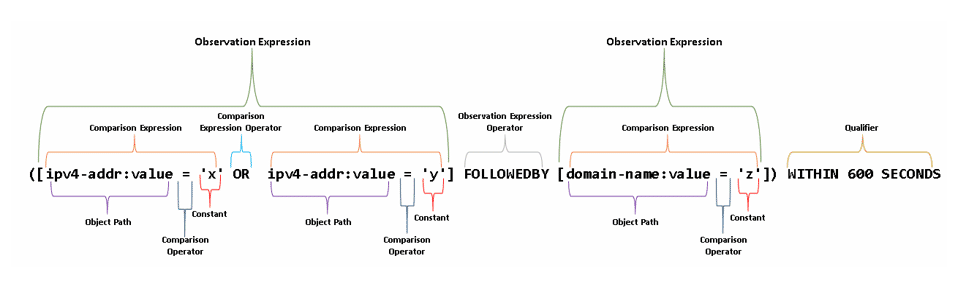

# Guide to STIX 2.1 ontology[^1]
  
Structured Threat Information Expression (STIX™) is a language and serialization format used to exchange cyber threat intelligence (CTI), aiming to increase accuracy and enable machine compatibility. It is developed by a consortium of field experts across many big corporations and organizations since 2015. The latest version of the standard is STIX 2.1, and it is currently in its early stages, still being adopted by many companies. The full standard is a horrifying 313 pages document, so I took the time to write this concise guide.


## What is Cyber Threat Intelligence (CTI)
"Threat intelligence is data that is collected, processed, and analyzed to understand a threat actor’s motives, targets, and attack behaviors", according to the Crowdstrike blog. In other words, it is all the data someone can gather on a cyber-threat. Being still in its infancy as an industry, all this work was done manually untill recently, in the form of human-generated reports with thousands of words and often times, ambiguous expressions. Some emerging formatting standards now like STIX, aim to revolutionize this practive by enforcing a set of rules that will make the cooperations of both CTI analysts and their computers, more efficient. 


## The STIX format
The STIX Technical Comitee has established a toolset for CTI analysts to be able to express their intelligence accurately, with the extra advantage of Machine Readable Threat Intelligence(MRTI). This is done with removing the need for old-fashioned pdf reports, and moving to a more flexible object-oriented representation in a JSON serialized file. The objects defined by the STIX2.1 standard include:
- **STIX Domain Objects(SDOs)**: the basic building blocks of the CTI. They hold the main pieces of information, and use the rest of the STIX objects to add context.
- **STIX Cyber-Observables(SCOs)**: the atomic, low-level objects that contain data about physical and virtual entities such as computers and networks.
- **STIX Relationship Objects(SROs)**: the basic ways two objects might be related to one another.
- **STIX Extention Definition Object**: new STIX objects created per the specific needs of the CTI producer, by the CTI producer.
- **STIX Meta Objects**:
- **STIX Patterning Language**:  


## The STIX Domain Objects (SDOs)
The SDOs in STIX play a very importand role, because they represent the basic entities of information, as we will see below. There are 19 SDOs, each one representing different physical entities and with different specifications.


### Attack Pattern
  
It (textually) describes a Tactic, Technique and Procedure(TTP): the way a threat actor(e.g. malicious hacker) may have compromised a system. For example it might be describing a Man in the Middle (MITM) or a Spear fishing attack. It can also refference the articular threat actor SDO(see below) that has been observed practicing that exact TTP.  

<details>
<summary>Detailed Object Variables</summary>

> Table with **Attack Pattern** object variables(R=required):  

| Required Common | Optional Common | Attack Pattern-Specific |
|---|---|---|
| (R) type | created_by_ref | (R) name |
| (R) spec_version | revoked | description |
| (R) id | labels | aliases |
| (R) created | confidence | kill_chain_phases |
| (R) modified | lang |  |
|  | external_references |  |
|  | object_marking_refs |  |
|  | granular_markings |  |
|  | extensions |  |
|  | labels |  |
</details>

<details>
<summary> Example of JSON representation </summary>

This is an example Attack Pattern JSON file.
```json
{
  "$schema": "http://json-schema.org/draft-04/schema#",
  "title": "attack-pattern",
  "description": "Attack Patterns are a type of TTP that describe ways that adversaries attempt to compromise targets. ",
  "type": "object",
  "allOf": [
    {
      "$ref": "../common/core.json"
    },
    {
      "properties": {
        "type": {
          "type": "string",
          "description": "The type of this object, which MUST be the literal `attack-pattern`.",
          "enum": [
            "attack-pattern"
          ]
        },
        "id": {
          "title": "id",
          "pattern": "^attack-pattern--"
        },
        "name": {
          "type": "string",
          "description": "The name used to identify the Attack Pattern."
        },
        "description": {
          "type": "string",
          "description": "A description that provides more details and context about the Attack Pattern,
                            potentially including its purpose and its key characteristics."
        },
        "kill_chain_phases": {
          "type": "array",
          "description": "The list of kill chain phases for which this attack pattern is used.",
          "items": {
            "$ref": "../common/kill-chain-phase.json"
          },
          "minItems": 1
        }
      }
    }
  ],
  "required": [
    "name"
  ]
}
```
</details>


### Campaign 
  
Defines a grouping of attacks over a specific set of targets, by a specific team or person over a period of time. They are attributed to an [Intrusion Set](#intrusion-set) and [Threat Actors](#threat-actor). They can also be characterized by the [incidents](#incident) they cause, the [infrastructure](#infrastructure) they target, and the [tools](#tool) or [malware](#malware) they use.  

<details>
<summary>Detailed Object Variables</summary>

> Table with **Campaign** object variables:

| Required Common | Optional Common | Campaign-Specific |
|---|---|---|
| (R) type | created_by_ref | (R) name |
| (R) spec_version | revoked | description |
| (R) id | confidence | aliases |
| (R) created | lang | first_seen |
| (R) modified | external_references | last_seen |
|  | object_marking_refs | objective |
|  | granular_markings |  |
|  | extensions |  |
|  | labels |  |
</details>


### Identity
  
They represent actual individuals,types of systems, organizations or groups. Can represent targets of attacks, information sources, STIX object authors, and [threat actors](#threat-actor).  

<details>
<summary>Detailed Object Variables</summary>

> Table with **Identity** object variables:

| Required Common | Optional Common | Identity-Specific |
|---|---|---|
| (R) type | created_by_ref | (R) name |
| (R) spec_version | revoked | description |
| (R) id | confidence | roles |
| (R) created | lang | identity_class |
| (R) modified | external_references | sectors |
|  | object_marking_refs | contact_information |
|  | granular_markings |  |
|  | extensions |  |
|  | labels | |
</details>


### Indicator
  
Patterns that can be used to detect malicious activity, for example malicious domains. It uses the [Stix Patterning Language](#stix-patterning-language) to specify these in a textual format. It combines the [Kill Chain](https://www.lockheedmartin.com/en-us/capabilities/cyber/cyber-kill-chain.html) phase with the time window of usefulness of the information. It can describe [malware](#malware), [tools](#tool) or [attack patterns](#attack-pattern) that it detects and it can also imply the presence of [campaigns](#campaign), [threat actors](#threat-actor), [intrusion sets](#intrusion-set) and more.   

<details>
<summary>Detailed Object Variables</summary>

> Table with **Indicator** object variables:

| Required Common | Optional Common | Indicator-Specific |
|---|---|---|
| (R) type | created_by_ref | name |
| (R) spec_version | revoked | description |
| (R) id | confidence | (R) indicator_types |
| (R) created | lang | (R) pattern |
| (R) modified | external_references | (R) pattern_type |
|  | object_marking_refs | pattern_version |
|  | granular_markings | (R) valid_from |
|  | extensions | valid_until |
|  | labels | kill_chain_phases |
</details>

### Infrastructure
  
Describes information about both defensive and offensive infrastructure in textual format.  

<details>
<summary>Detailed Object Variables</summary>

> Table with **Infrastructure** object variables:

| Required Common | Optional Common | Infrastructure-Specific |
|---|---|---|
| (R) type | created_by_ref | (R) name |
| (R) spec_version | revoked | description |
| (R) id | confidence | (R) infrastructure_types |
| (R) created | lang | aliases |
| (R) modified | external_references | kill_chain_phases |
|  | object_marking_refs | first_seen |
|  | granular_markings | last_seen |
|  | extensions |  |
|  | labels |  |
</details>

### Location
  
It represents a geographic location,for example *"East Russsia"* or "*37.981911° N, 23.755400° E*" (note that exact locations must be in WSG84 format). Can be related to an [Intrusion Set](#intrusion-set) or [Identity](#identity) to imply their location. It must **not** be confused with governments and land owners, it only shows geographical locations.  

<details>
<summary>Detailed Object Variables</summary>

> Table with **Location** object variables:

| Required Common | Optional Common | Location-Specific |
|---|---|---|
| (R) type | created_by_ref | name |
| (R) spec_version | revoked | description |
| (R) id | confidence | latitude |
| (R) created | lang | longtitude |
| (R) modified | external_references | precision |
|  | object_marking_refs | region |
|  | granular_markings | country |
|  | extensions | administrative_area |
|  | labels | city |
|  |  | street_address |
|  |  | postal_code |
</details>
 
### Malware
  
It is a malicious code/program, part of a TTP usually. It captures the detailed way the malware works, and what it does. [STIX Patterning Language](#stix-patterning-language) is strongly advised to be used, because of the interoperability benefits it would offer.  

<details>
<summary>Detailed Object Variables</summary>

> Table with **Malware** object variables:

| Required Common | Optional Common | Malware-Specific |
|---|---|---|
| (R) type | created_by_ref | name |
| (R) spec_version | revoked | description |
| (R) id | confidence | (R) malware_types |
| (R) created | lang | (R) is_family |
| (R) modified | external_references | aliases |
|  | object_marking_refs | kill_chain_phases |
|  | granular_markings | first_seen |
|  | extensions | last_seen |
|  | labels | os_execution_envs |
|  |  | architectire_execution_envs |
|  |  | implementation_languages |
|  |  | capabilities |
|  |  | sample_refs |
</details>


### Note
  
They can be created by anyone(including the object creator and consumers) to convey human-readable messages or other information that cannot be included in the initial STIX object.  

<details>
<summary>Detailed Object Variables</summary>

> Table with **Note** object variables:

| Required Common | Optional Common | Note-Specific |
|---|---|---|
| (R) type | created_by_ref | abstract |
| (R) spec_version | revoked | (R) content |
| (R) id | confidence | authors |
| (R) created | lang | (R) object_refs |
| (R) modified | external_references |  |
|  | object_marking_refs |  |
|  | granular_markings |  |
|  | extensions |  |
|  | labels |  |
</details>


### Observed Data
  
It contains low-level information on observed data, such as files(filenames, hashes etc), systems(models and manufacturers) and networks(IP addresses etc.). To improve understandability, context must be added with the use of [SCOs](#stix-cyber-observables-scos)! An [SRO](#stix-relationship-objectssros) such as a[Sighting](#stix-sighting-relationship) can also link the Observed Data object with a [Malware](#malware) or an [Indicator](#indicator) SDO.  


<details>
<summary>Detailed Object Variables</summary>

> Table with **Observed Data** object variables:

| Required Common | Optional Common | Observed-Data-Specific |
|---|---|---|
| (R) type | created_by_ref | (R) first_observed |
| (R) spec_version | revoked | (R) last_observed |
| (R) id | confidence | (R) number_observed |
| (R) created | lang | objects |
| (R) modified | external_references | object_refs |
|  | object_marking_refs |  |
|  | granular_markings |  |
|  | extensions |  |
|  | labels |  |
</details>


### Threat Actor
  
Individuals, groups or organizations that may have malicious intent. They can be affiliated with certain [Intrusion Sets](#intrusion-set), and can run [Campaigns](#campaign) against targets. In the STIX Specification there are [STIX Vocabularies](#stix-vocabularies) that define the set of words that must be used to express some of the properties of the Threat actos, such as sophistication level, resoursec, capabilities, motives etc.  

<details>
<summary>Detailed Object Variables</summary>

> Table with **Threat Actor** object variables:

| Required Common | Optional Common | Threat-Actor-Specific |
|---|---|---|
| (R) type | created_by_ref | (R) first_observed |
| (R) spec_version | revoked | (R) name |
| (R) id | confidence | description |
| (R) created | lang | (R) threat_actor_types |
| (R) modified | external_references | aliases |
|  | object_marking_refs | first_seen |
|  | granular_markings | last_seen |
|  | extensions | roles |
|  | labels | goals |
|  |  | sophistication |
|  |  | resource_level |
|  |  | primary_motivation |
|  |  | secondary_motivation |
|  |  | personal_motivation |
</details>

### Tool
  
Tools and software that is used in malicious activity. It differs from the malware in the way that these tools can be used legitimately by eg. system administrators(for example nmap or PowerShell). It characterizes the properties of these tools, and can be related to a [Threat Actor](#threat-actor) and the way they use the tool.  


<details>
<summary>Detailed Object Variables</summary>

> Table with **Tool** object variables:

| Required Common | Optional Common | Tool-Specific |
|---|---|---|
| (R) type | created_by_ref | (R) name |
| (R) spec_version | revoked | description |
| (R) id | confidence | (R) tools_types |
| (R) created | lang | aliases |
| (R) modified | external_references | kill_chain_phases |
|  | object_marking_refs | tool_version |
|  | granular_markings |  |
|  | extensions |  |
|  | labels |  |
</details>

### Vulnerabillity
  
Defines vulnerabilities found in software, hardware or physical practices of an organiation. It can be expressed as one or many [CVEs](https://www.cve.org/).  
<details>
<summary>Detailed Object Variables</summary>

> Table with **Vulnerability** object variables:

| Required Common | Optional Common | Vulnerability-Specific |
|---|---|---|
| (R) type | created_by_ref | external_references |
| (R) spec_version | revoked | (R) name |
| (R) id | confidence | description |
| (R) created | lang |  |
| (R) modified | external_references |  |
|  | object_marking_refs |  |
|  | granular_markings |  |
|  | extensions |  |
|  | labels |  |
</details>


### Course of Action
  
Describes actions that can be taken either to avoid, defent against or recover from an attack. It does **not** support automated (machine readable) responses, and it is still a SDO under development. It can be linked with a certain type of an [attack](#attack-pattern), and it is of textual format.  

<details>
<summary>Detailed Object Variables</summary>

> Table with **Course of Action** object variables:

| Required Common | Optional Common | Course of Action-Specific |
|---|---|---|
| (R) type | created_by_ref | (R) name |
| (R) spec_version | revoked | description |
| (R) id | confidence | action (reserved) |
| (R) created | lang |  |
| (R) modified | external_references |  |
|  | object_marking_refs |  |
|  | granular_markings |  |
|  | extensions |  |
|  | labels |  |
</details>

### Grouping
  
An abstract, more high level representation of a team of SDOs that have some contextual relationship with one another. Not to be confused with the [Report](#report) SDO.  

<details>
<summary>Detailed Object Variables</summary>

> Table with **Grouping** object variables:

| Required Common | Optional Common | Grouping-Specific |
|---|---|---|
| (R) type | created_by_ref | name |
| (R) spec_version | revoked | description |
| (R) id | confidence | (R) context |
| (R) created | lang | (R) object_refs |
| (R) modified | external_references |  |
|  | object_marking_refs |  |
|  | granular_markings |  |
|  | extensions |  |
|  | labels |  |
</details>


### Incident
  
Still under developement and not actively used, the Incident SDO can textually represent security related incidents. It can be extended with an extension point using the [Extension Definition](#stix-extension-definition-object) object.  

<details>
<summary>Detailed Object Variables</summary>

> Table with **Incident** object variables:

| Required Common | Optional Common | Incident-Specific |
|---|---|---|
| (R) type | created_by_ref | (R) name |
| (R) spec_version | revoked | description |
| (R) id | confidence | roles |
| (R) created | lang | identity_class |
| (R) modified | external_references | sectors |
|  | object_marking_refs | contact_information |
|  | granular_markings |  |
|  | extensions |  |
|  | labels |  |
</details>

### Intrusion Set
  
A set of hostile behaviours that is believed to be conducted by the same person, team or organization. It may contain multiple [campaigns](#campaign) and all the data can be tied to a [threat actor](#threat-actor), even though it is not neccessary.  

<details>
<summary>Detailed Object Variables</summary>

> Table with **Intrusion Set** object variables:

| Required Common | Optional Common | Intrusion Set-Specific |
|---|---|---|
| (R) type | created_by_ref | (R) name |
| (R) spec_version | revoked | description |
| (R) id | confidence | aliases |
| (R) created | lang | first_seen |
| (R) modified | external_references | last_seen |
|  | object_marking_refs | goals |
|  | granular_markings | resource_level |
|  | extensions | primary_motivation |
|  | labels | secondary_motivation |
</details>

### Malware Analysis
  
It contains the results of analysis of a [malware](#malware) instance. It can contain the malware samples **must** be defanged (archived and password protected).  

<details>
<summary>Detailed Object Variables</summary>

> Table with **Malware Analysis** object variables:

| Required Common | Optional Common | Malware Analysis-Specific |
|---|---|---|
| (R) type | created_by_ref | (R) product |
| (R) spec_version | revoked | version |
| (R) id | confidence | host_vm_ref |
| (R) created | lang | operating_system |
| (R) modified | external_references | installed_system_ref |
|  | object_marking_refs | configuration_version |
|  | granular_markings | module |
|  | extensions | analysis_engine_version |
|  | labels | analysis_definition_version |
|  |  | submitted |
|  |  | analysis_started |
|  |  | analysis_ended |
|  |  | av_result |
|  |  | analysis_sco_refs |
</details>


### Opinion
  
A human accessment of the correctness of the information in a STIX Object, produced by someone else, that also has an agreement/disagreement degree field (eg. someone can **strongly** disagree). It can also express the reason why the author expressed that opinion.  

<details>
<summary>Detailed Object Variables</summary>

> Table with **Opinion** object variables:

| Required Common | Optional Common | Opinion-Specific |
|---|---|---|
| (R) type | created_by_ref | explanation |
| (R) spec_version | revoked | authors |
| (R) id | confidence | (R) opinions |
| (R) created | lang | (R) object_refs |
| (R) modified | external_references |  |
|  | object_marking_refs |  |
|  | granular_markings |  |
|  | extensions |  |
|  | labels |  |
</details>

### Report
  
A collection of threat intelligence objects, that constitute a report on some topic. It is usually used by security firms to disseminate reports on campaigns or known threat groups.   

<details>
<summary>Detailed Object Variables</summary>

> Table with **Report** object variables:

| Required Common | Optional Common | Report-Specific |
|---|---|---|
| (R) type | created_by_ref | (R) name |
| (R) spec_version | revoked | description |
| (R) id | confidence | (R) report_types |
| (R) created | lang | (R) published |
| (R) modified | external_references | (R) object_refs |
|  | object_marking_refs |  |
|  | granular_markings |  |
|  | extensions |  |
|  | labels |  |
</details>

## STIX Cyber-Observables (SCOs)

The STIX Cyber Observables is a set of more detailed representation of some entities. They are also described as the atomic elements of the data model. There are:
- **Artifact**: a link to a file or a url.
  <details>
  <summary> Fields </summary>  
  (With X meaning "ID Contributing Properties", something like a secondary key)
  | Required Common | Optional Common | Object-Specific Properties |
  |---|---|---|
  | (R) type | spec_version | mime_type |
  | (R) id | object_marking_refs | payload_bin (X) |
  |  | granular_markings | url  |
  |  | defanged | hashes (X) |
  |  | extensions | encryption_algorithm |
  |  |  | decryption_key |
  </details>


- **Autonomous System**: an autonomous or otherwise centrally controlled network system.  
  <details>
  <summary> Fields </summary>  

  | Required Common | Optional Common | Object-Specific properties |
  |---|---|---|
  | (R) type | spec_version | (R) number (X) |
  | (R) id | object_marking_refs | name |
  |  | granular_markings | rir |
  |  | defanged |  |
  |  | extensions |  |
  </details>


- **Directory**: a filesystem directory.  
  <details>
  <summary> Fields </summary> 

  | Required Common | Optional Common | Object-Specific properties |
  |---|---|---|
  | (R) type | spec_version | (R) path |
  | (R) id | object_marking_refs | path_enc |
  |  | granular_markings | ctime |
  |  | defanged | mtime |
  |  | extensions | atime |
  |  |  | contains_refs |
  </details>


- **Domain Name**: a typical domain name.  
  <details>
  <summary> Fields </summary> 

  | Required Common | Optional Common | Object-Specific properties |
  |---|---|---|
  | (R) type | spec_version | (R) value (X) |
  | (R) id | object_marking_refs | resolves_to_refs [^2] |
  |  | granular_markings |  |
  |  | defanged |  |
  |  | extensions |  |
  </details>


- **Email Address**: a typical email address.  
  <details>
  <summary> Fields </summary>  

  | Required Common | Optional Common | Object-Specific properties |
  |---|---|---|
  | (R) type | spec_version | (R) value (X) |
  | (R) id | object_marking_refs | display_name |
  |  | granular_markings | belongs_to_ref |
  |  | defanged |  |
  |  | extensions |  |
  </details>


- **Email Message**: an instance of a typical email message, with all the analytical metadata.  
  <details>
  <summary> Fields  </summary> 

  | Required Common | Optional Common | Object-Specific properties |
  |---|---|---|
  | (R) type | spec_version | (R) is_multipart  |
  | (R) id | object_marking_refs | date |
  |  | granular_markings | content_type |
  |  | defanged | from_ref (X) |
  |  | extensions | sender_ref |
  |  |  | to_refs |
  |  |  | cc_refs |
  |  |  | bcc_refs |
  |  |  | message_id |
  |  |  | subject (X) |
  |  |  | received_lines |
  |  |  | additional_header_fields |
  |  |  | body (X) |
  |  |  | body_multipart |
  |  |  | raw_email_ref |
  </details>


- **File**: represents the properties of a file, like a file name or a hash. It does NOT contain the file, like the artifact does(?).  
  <details>
  <summary> Fields </summary> 

  | Required Common | Optional Common | Object-Specific Properties |
  |---|---|---|
  | (R) type | spec_version | hashes (X) |
  | (R) id | object_marking_refs | size |
  |  | granular_markings | name (X) |
  |  | defanged | name_enc |
  |  | extensions | magic_number_index |
  |  |  | mime_type |
  |  |  | ctime |
  |  |  | mtime |
  |  |  | atime |
  |  |  | parent_directory_ref |
  |  |  | contains_ref |
  |  |  | content_ref |
  </details>


- **IPv4**: an IP version 4 address.  
  <details>
  <summary> Fields </summary>  

  | Required Common | Optional Common | Object-Specific Properties |
  |---|---|---|
  | (R) type | spec_version | (R) value |
  | (R) id | object_marking_refs | resolves_to_refs [^2] |
  |  | granular_markings | belongs_to_refs[^2] |
  |  | defanged |  |
  |  | extensions |  |
  </details>


- **IPv6**: an IP version 6 address.  
  <details>
  <summary> Fields </summary> 
    
  | Required Common | Optional Common | Object-Specific Properties |
  |---|---|---|
  | (R) type | spec_version | (R) value |
  | (R) id | object_marking_refs | resolves_to_refs [^2] |
  |  | granular_markings | belongs_to_refs[^2] |
  |  | defanged |  |
  |  | extensions |  |
  </details>


- **MAC Address**: a Media Access Control address.  
  <details>
  <summary> Fields </summary> 

  | Required Common | Optional Common | Object-Specific Properties |
  |---|---|---|
  | (R) type | spec_version | (R) value (X) |
  | (R) id | object_marking_refs |  |
  |  | granular_markings |  |
  |  | defanged |  |
  |  | extensions |  |
  </details>


- **Mutex**: a mutual-exclusion software object.  
  <details>
  <summary> Fields </summary>  

  | Required Common | Optional Common | Object-Specific Properties |
  |---|---|---|
  | (R) type | spec_version | (R) name (X) |
  | (R) id | object_marking_refs |  |
  |  | granular_markings |  |
  |  | defanged |  |
  |  | extensions |  |
  </details>


- **Network Traffic**: network traffic from a certain source to a certain destination(even if a connection is not established).  
  <details>
  <summary> Fields </summary>  

  | Required Common | Optional Common | Object-Specific Properties |
  |---|---|---|
  | (R) type | spec_version | start (X) |
  | (R) id | object_marking_refs | end |
  |  | granular_markings | is_active |
  |  | defanged | src_ref (X) |
  |  | extensions | dst_ref (X) |
  |  |  | src_port (X) |
  |  |  | dst_port (X) |
  |  |  | protocols (X) |
  |  |  | src_byte_count |
  |  |  | dst_byte_count |
  |  |  | src_packets |
  |  |  | dst_packets |
  |  |  | ipfix |
  |  |  | src_payload_ref |
  |  |  | dst_payload_ref |
  |  |  | encapsulates_ref |
  |  |  | encapsulates_by_ref |
  </details>


- **Process**: It describes the properties of an instance of a computer program(process).  
  <details>
  <summary> Fields </summary>  

  | Required Common | Optional Common | Object-Specific Properties |
  |---|---|---|
  | (R) type | spec_version | is_hidden |
  | (R) id | object_marking_refs | pid |
  |  | granular_markings | created_time |
  |  | defanged | cwd |
  |  | extensions | command_line |
  |  |  | environment_variables |
  |  |  | opened_connection_refs |
  |  |  | creator_user_ref |
  |  |  | image_ref |
  |  |  | parent_ref |
  |  |  | child_refs |
  </details>


- **Software**: high level propeties of software packages.  
  <details>
  <summary> Fields </summary>  

  | Required Common | Optional Common | Object-Specific Properties |
  |---|---|---|
  | (R) type | spec_version | (R) name (X) |
  | (R) id | object_marking_refs |  cpe (X) |
  |  | granular_markings | languages |
  |  | defanged | vendor (X) |
  |  | extensions | version (X) |
  </details>


- **URL**: a Uniform Resource Locator link and its properties.  
  <details>
  <summary> Fields </summary>  

  | Required Common | Optional Common | Object-Specific Properties |
  |---|---|---|
  | (R) type | spec_version | (R) value |
  | (R) id | object_marking_refs |  |
  |  | granular_markings |  |
  |  | defanged |  |
  |  | extensions |  |
  </details>


- **User Account**: an instance of a user account(eg. operating system credentials, messaging service/social media credentials etc).  
  <details>
  <summary> Fields </summary>  

  | Required Common | Optional Common | Object-Specific Properties |
  |---|---|---|
  | (R) type | spec_version | user_id (X) |
  | (R) id | object_marking_refs | credential |
  |  | granular_markings | account_login (X) |
  |  | defanged | account_type (X) |
  |  | extensions | display_name |
  |  |  | is_service_account |
  |  |  | is_privileged |
  |  |  | can_escape_privs |
  |  |  | is_disabled |
  |  |  | account_created |
  |  |  | account_expires |
  |  |  | credential_last_changed |
  |  |  | account_first_login |
  |  |  | account_last_login |
  </details>


- **Windows Registry Key**: a windows registry key and its properties.  
  <details>
  <summary> Fields  </summary>  

  | Required Common | Optional Common | Object-Specific Properties |
  |---|---|---|
  | (R) type | spec_version | key (X) |
  | (R) id | object_marking_refs | values (X) |
  |  | granular_markings | modified_time |
  |  | defanged | creator_user_ref |
  |  | extensions | number_of_subkeys |
  </details>


- **X.509 Certificate**: (?)  
  <details>
  <summary> Fields </summary>  

  | Required Common | Optional Common | Object-Specific Properties |
  |---|---|---|
  | (R) type | spec_version | is_self_signed |
  | (R) id | object_marking_refs | hashes (X) |
  |  | granular_markings | version |
  |  | defanged | serial_number (X) |
  |  | extensions | signature_algorithm |
  |  |  | issuer |
  |  |  | validity_not_bevore |
  |  |  | validity_not_after |
  |  |  | subject |
  |  |  | subject_public_key_algorithm |
  |  |  | subject_public_key_modules |
  |  |  | subject_public_key_exponent |
  |  |  | x509_c3_extensions |
  </details>
  

## STIX Relationship Objects(SROs)
The relationship objects connect individual SDOs together, to form graphs of knowledge where the nodes represent the data(SDOs and SCOs) and the edges represent the relationships between objects(SROs).

### STIX Generic Relationship Object
  
This is a generic relationship, and it's context is given by the fields referencing it, in the objects it connects.

### STIX Sighting Relationship
  
A sighting is a special relationship, that incorporates extra information like a counter that informs us of the times something is sighted.  


## STIX Extension Definition Object
 It is a way to define new STIX objects, like SDOs SCOs and SROs. These custom objects can fulfill specific, usually technical needs, that the STIX technical comitee did not foresee during the development of STIX 2.1. More information can be found [here](https://stix2.readthedocs.io/en/latest/guide/extensions.html).

## STIX Meta Objects
There are two STIX 2.1 meta objects, that give extra meaning to groups of other objects. One of them is the **Language Content** object, that can represent translations of another objects. The other is **Data Markings** objects that enforce restrictions, permissions and general guidance to the distribution and use of the CTI.

## STIX Patterning Language

A semantic language that tries to eradicate amgiuous meanings in common expressions used in STIX objects. More info [here](https://docs.oasis-open.org/cti/stix/v2.0/stix-v2.0-part5-stix-patterning.html).

## STIX Vocabularies
More information [here](https://docs.oasis-open.org/cti/stix/v1.2.1/stix-v1.2.1-part14-vocabularies.html).

# What do to next
After reading and understanding most of the above, you will be ready to see and understand the real-life examples that are shown [here](https://oasis-open.github.io/cti-documentation/stix/walkthrough). After that, its you and the [specification](https://docs.oasis-open.org/cti/stix/v2.1/os/stix-v2.1-os.html). Good Luck!


---
[^1]: All the information contained in this document is also offered through the official OASIS Foundation channels, such as [here](https://docs.oasis-open.org/cti/stix/v2.1/csprd01/stix-v2.1-csprd01.html)(for seasoned analysts) and [here](https://oasis-open.github.io/cti-documentation/stix/intro.html)(for beginners). What I do here is just a summary of the official documentation, with the aim to make it easy to navigate both for beginners that need to learn everything from the beginning and for professionals that need a reminder on something. Also, all the images ar property of OASIS Foundation. Finally, the structure of this document is based on the official course that can be found [here](https://cyberthreatintelligencenetwork.com/wp-content/uploads/articulate_uploads/an-introduction-to-the-stix-2-1-data-model-scorm12-j3K5cX1L-1/scormcontent/index.html#/).
[^2]: depreciated in STIX 2.1.
